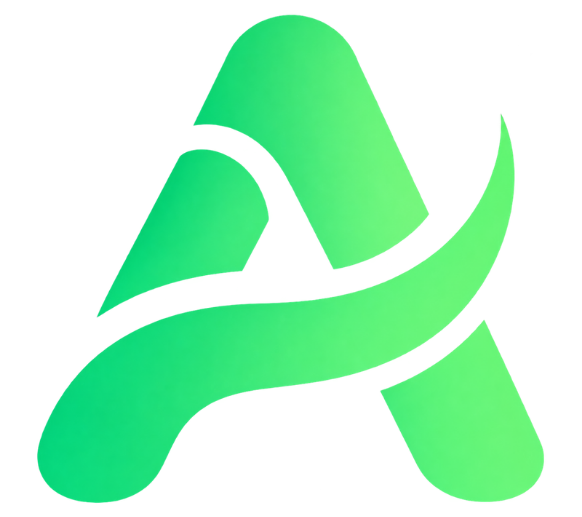
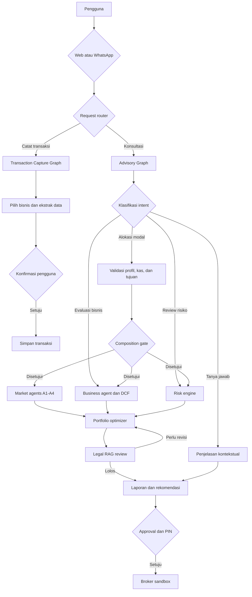

<div align="center">
  

  <h1>AstaLink AI</h1>

  <p><strong>Platform investasi saham IDX dengan analisis multi-agent,<br />pemeriksaan regulasi, dan kontrol penuh di tangan pengguna.</strong></p>

  <p>
    <a href="https://astalink.my.id">Website</a>
    ·
    <a href="#quick-start">Quick start</a>
    ·
    <a href="#arsitektur">Arsitektur</a>
    ·
    <a href="#pengujian">Pengujian</a>
  </p>

  <p>
    
    
    
    
    
  </p>
</div>

---

AstaLink membantu investor dan pemilik bisnis Indonesia menilai pilihan penggunaan modal: disimpan sebagai kas, dialokasikan ke saham IDX, atau digunakan untuk peluang bisnis. Sistem menggabungkan data pasar, profil risiko, valuasi bisnis, dan regulasi ke dalam satu workflow LangGraph yang dapat dilacak.

AstaLink berjalan dalam mode **advisory-first**. Agent menyiapkan analisis dan rekomendasi. Pengguna tetap mengambil keputusan akhir, memasukkan PIN, dan menyetujui setiap transaksi. Portofolio yang tersedia saat ini masih berupa broker sandbox.

## Cara AstaLink membantu

| Analisis multi-agent | Pemeriksaan sebelum rekomendasi | Keputusan tetap milik pengguna |
| --- | --- | --- |
| Agent fundamental, teknikal, sentimen, dan makro bekerja secara paralel. | Risk engine dan legal RAG memeriksa hasil sebelum laporan ditampilkan. | Tidak ada pembelian otomatis. Approval dan PIN selalu berada di luar keputusan agent. |

## Kemampuan

| Area | Yang dikerjakan |
| --- | --- |
| Market intelligence | Analisis fundamental, indikator teknikal, sentimen berita, dan kondisi makro. |
| Capital allocation | Rekomendasi komposisi kas, saham, dan investasi bisnis berdasarkan tujuan pengguna. |
| Portfolio risk | VaR, Sharpe ratio, covariance, dan optimasi portofolio berbasis CVXPY. |
| Business valuation | Proyeksi arus kas dan valuasi DCF untuk peluang bisnis. |
| Legal review | Hybrid retrieval dengan Pinecone, BM25, Reciprocal Rank Fusion, dan sumber yang dapat ditelusuri. |
| Transaction capture | Pencatatan transaksi bisnis dari pesan teks atau foto struk, termasuk konfirmasi sebelum disimpan. |
| Human approval | Permintaan data tambahan, persetujuan komposisi, dan konfirmasi transaksi dengan PIN. |
| Auditability | `audit_id`, event log, checkpoint workflow, metrik Prometheus, dan dashboard Grafana. |
| Channels | Percakapan melalui aplikasi web dan WhatsApp. |

## Arsitektur



### Batas tanggung jawab agent

| Komponen | Tanggung jawab |
| --- | --- |
| LLM | Mengklasifikasikan intent, mengekstrak data, menggunakan konteks, dan menyusun penjelasan. |
| Kode deterministik | Menghitung metrik risiko, valuasi, optimasi, validasi, dan aturan keputusan. |
| Human-in-the-loop | Melengkapi data yang kurang serta menyetujui komposisi dan transaksi. |
| Risk dan legal | Dapat menahan rekomendasi atau mengembalikannya untuk direvisi. |
| Checkpointer | Menyimpan state agar workflow dapat dilanjutkan dan diaudit. |

Data yang belum cukup tidak diisi dengan tebakan. Graph akan berhenti dan meminta informasi tambahan. Review legal juga memiliki batas iterasi agar workflow tidak berputar tanpa akhir.

## Stack

| Layer | Teknologi |
| --- | --- |
| Frontend | Next.js 16, React 19, TypeScript, Tailwind CSS, shadcn/ui |
| API dan orchestration | FastAPI, LangGraph, LangChain |
| Model | Google Gemini atau model OpenAI-compatible melalui SumoPod |
| Database dan auth | Supabase, PostgreSQL |
| Retrieval | Pinecone, BM25, Reciprocal Rank Fusion |
| Quantitative engine | NumPy, SciPy, CVXPY, pandas, yfinance, TA-Lib |
| Observability | Prometheus, Grafana |
| Runtime | Docker Compose, Traefik, Dokploy |

## Struktur repository

```text
astalink/
├── frontend/                 # Next.js App Router dan antarmuka pengguna
├── backend/
│   ├── app/agents/           # State, node, routing, dan graph LangGraph
│   ├── app/api/v1/           # Endpoint API per domain
│   ├── app/core/             # Konfigurasi dan layanan bersama
│   ├── migrations/           # Migrasi SQL berurutan
│   └── tests/                # Test backend
├── grafana/                  # Provisioning dashboard
├── prometheus/               # Konfigurasi scraping
├── docker-compose.yml        # Development stack
└── docker-compose.prod.yml   # Production stack
```

## Quick start

### Prasyarat

- Docker dan Docker Compose v2
- Node.js 20+ untuk menjalankan frontend tanpa container
- Python 3.12+ dan `uv` untuk menjalankan backend tanpa container

### 1. Siapkan environment

```bash
cp .env.example .env
```

Isi konfigurasi Supabase dan satu provider model:

```dotenv
SUPABASE_URL=
SUPABASE_ANON_KEY=
SUPABASE_JWT_SECRET=
SUPABASE_SERVICE_ROLE_KEY=

NEXT_PUBLIC_SUPABASE_URL=
NEXT_PUBLIC_SUPABASE_ANON_KEY=

LLM_PROVIDER=gemini
GOOGLE_API_KEY=
```

Gunakan `LLM_PROVIDER=sumopod` beserta variabel `SUMOPOD_*` jika ingin memakai endpoint OpenAI-compatible.

<details>
<summary>Konfigurasi fitur tambahan</summary>

| Fitur | Environment variable |
| --- | --- |
| Database langsung dan checkpointer | `DATABASE_URL`, `SUPABASE_DB_URL` |
| Legal RAG | `PINECONE_API_KEY`, `PINECONE_INDEX_NAME` |
| Berita pasar | `NEWS_API_KEY` |
| Email | `RESEND_API_KEY`, `RESEND_FROM_EMAIL` |
| Admin | `ADMIN_EMAILS` |
| WhatsApp | `WHATSAPP_VERIFY_TOKEN`, `WHATSAPP_APP_SECRET`, `WHATSAPP_ACCESS_TOKEN`, `WHATSAPP_PHONE_NUMBER_ID` |

</details>

### 2. Jalankan migrasi

Eksekusi file `backend/migrations/NNNN_*.sql` secara berurutan melalui Supabase SQL Editor.

### 3. Mulai development stack

```bash
make dev
```

| Service | URL |
| --- | --- |
| Frontend | <http://localhost:3002> |
| Backend API | <http://localhost:8000> |
| OpenAPI | <http://localhost:8000/docs> |
| Prometheus | <http://localhost:9090> |
| Grafana | <http://localhost:3005> |

TA-Lib membutuhkan library native saat backend dijalankan langsung di host. Docker image backend sudah memasang dependency tersebut.

## Pengujian

Jalankan test backend:

```bash
make test-backend
```

Periksa tipe frontend:

```bash
cd frontend
npx tsc --noEmit
```

## Deployment

```bash
make prod
```

Production stack menggunakan label Traefik dan ditujukan untuk deployment melalui Dokploy. Isi `PROD_DOMAIN`, `PROD_DOMAIN_HOST`, kredensial layanan, dan seluruh secret dengan nilai production sebelum deploy.

## Status proyek

AstaLink masih digunakan untuk riset dan simulasi keputusan keuangan. Integrasi broker riil belum tersedia. Analisis dari sistem ini bukan pengganti nasihat keuangan, hukum, atau pajak dari profesional berlisensi.
