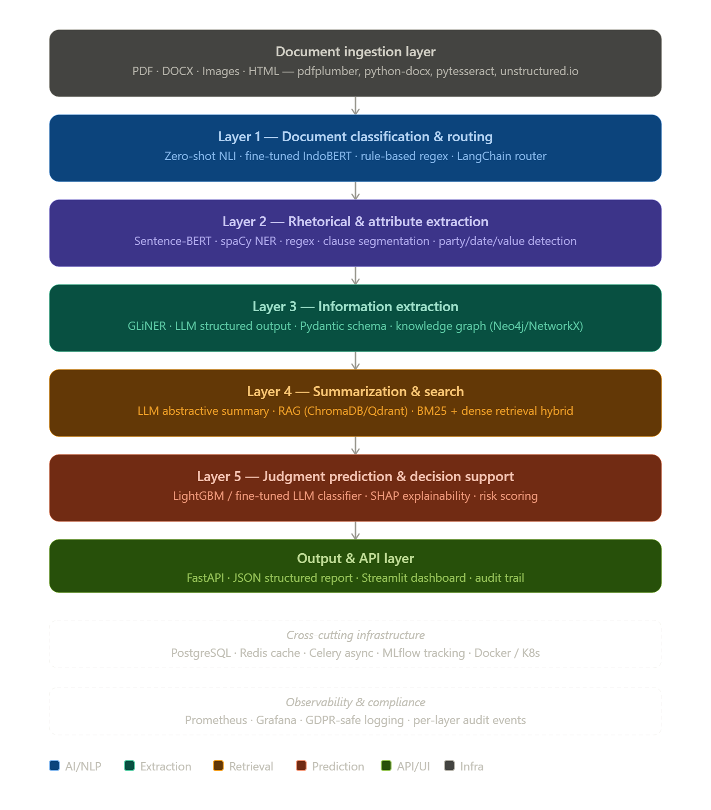

# **Notepad `AstaLink` - Legal Documents Analyzer**

> Deteksi, Analisis dan Pengambilan Keputusan berdasarkan **Legal Documents** pada project `AstaLink`. Selanjutnya disingkat **Legal Docs Analyzer**

```
Target: Sistem AI berhasil memberikan rekomendasi investasi yang relevan dan sesuai regulasi OJK/perpajakan dalam waktu respons kurang > dari 10 detik melalui WhatsApp.
```

## **Daftar Isi**

1. [**Core Task**](#1-core-task)
2. [**Sumber Dokumen Legal tentang**](#2-sumber-dokumen-legal)
3. [**Struktur Projek**](#3-structure)
4. [**Tech Stack**](#4-tech-stack)

## **1. Core Task**

- **Document classification & routing:** Classifying legal texts (e.g., case type, document type) using random forests, deep learning, and LegalBERT, often outperforming generic models.
- **Rhetorical and attribute extraction:** Classifying sentence roles and extracting attributes (facts, charges, statutes) from judgments using Bi‑LSTMs and few‑shot LLM sequence labeling, supporting downstream judgment and statute prediction.
- **Information extraction:** Tools like LexNLP extract dates, entities, clauses and other structured fields from contracts and regulatory filings.
- **Summarization & search:** Legal document summarization and retrieval, often with transformer/LLM-based methods, are central tasks in recent surveys.
- **Judgment prediction & decision support:** NLP+ML/LLMs predict charges, applicable articles, penalties, and outcomes, though data scarcity, imbalance, and low performance remain challenges.

## **2. Sumber Dokumen Legal** 
1. UUD 1945
2. Bank Indonesia
3. Otoritas Jasa Keuangan
4. Kementrian Keuangan

## **3. System Algorithm** 


### Layer 1 - Document Classification & Routing
```
INPUT: raw document bytes / text
ALGORITHM:
  1. Pre-screening:
     - Deteksi format (PDF/DOCX/image) → dispatch ke extractor yg sesuai
     - Language detection (langdetect) → flag Bahasa Indonesia vs Inggris
  2. Hierarchical classification:
     a. Rule-based filter (regex): tangkap kata kunci kuat
        e.g. "surat kuasa", "perjanjian kredit", "putusan", "skmht"
     b. Zero-shot NLI (IndoBERT/mDeBERTa) untuk kategori ambigu
        candidate_labels = ["perjanjian kredit", "akta jaminan", "putusan pengadilan",
                            "surat perintah", "laporan keuangan", "prospektus"]
     c. Confidence threshold: jika score < 0.65 → human review queue
  3. Routing output: {doc_type, confidence, priority_queue, assigned_pipeline}
```

### Layer 2 - Rhetorical & Attribute Extraction
```
INPUT: classified document + doc_type
ALGORITHM:
  1. Clause segmentation:
     - Sentence boundary detection (spaCy id_core_news_lg)
     - Structural parsing: pasal → ayat → butir (via regex heading pattern)
  2. Rhetorical role labeling:
     - Fine-tuned sequence classifier per doc_type
     - Labels: [OBLIGATION, PROHIBITION, PERMISSION, CONDITION,
                DEFINITION, PENALTY, TERMINATION, RECITAL]
  3. Attribute extraction:
     - NER: PARTY, DATE, AMOUNT, CURRENCY, INTEREST_RATE, COLLATERAL
     - Normalization: tanggal → ISO 8601, nominal → float + currency code
     - Relation triplets: (party_A) --[OBLIGASI]--> (party_B, amount, deadline)
  4. Output: structured clause map + entity JSON
```

### Layer 3 -  Information Extraction (Structured)
```
INPUT: clause map + entity JSON
ALGORITHM:
  1. LLM-based structured extraction:
     - Prompt: "Ekstrak field berikut dari klausul ini dalam format JSON..."
     - Schema enforce via Pydantic v2 + instructor library
     - Field set per doc_type (e.g. kredit: pokok, bunga, tenor, denda, jaminan)
  2. Cross-document entity resolution:
     - Fuzzy matching nama pihak (RapidFuzz)
     - Dedup & canonical entity store (PostgreSQL + pgvector)
  3. Knowledge graph construction:
     - Node: dokumen, pihak, aset, kewajiban
     - Edge: relasi semantik dari triplet layer 2
     - Store: NetworkX (in-memory) atau Neo4j (persistent)
  4. Consistency validation:
     - Cross-field checks: bunga_efektif vs bunga_nominal
     - Date ordering: tanggal_mulai < tanggal_jatuh_tempo
     - Mandatory field completeness check
```

### Layer 4 - Summarization & Search
```
INPUT: structured data + original text chunks
ALGORITHM:
  1. Chunking strategy:
     - Clause-aware chunking (bukan fixed token window)
     - Overlap: 1 kalimat antar chunk untuk konteks
  2. Embedding & indexing:
     - Dense: multilingual-e5-large → ChromaDB / Qdrant
     - Sparse: BM25 (rank_bm25) untuk exact term matching
     - Hybrid retrieval: RRF (Reciprocal Rank Fusion) score
  3. Abstractive summarization:
     - Map-Reduce: ringkas per section → merge jadi executive summary
     - Template: risiko, kewajiban utama, jatuh tempo, jaminan, klausul kritis
  4. Search API:
     - Query expansion via LLM (sinonim legal Bahasa Indonesia)
     - Re-ranking: cross-encoder (ms-marco-multilingual)
```

### Layer 5 - Judgment Prediction & Decision Support
```
INPUT: structured features dari layer 1-4
ALGORITHM:
  1. Feature engineering:
     - Numerik: LTV ratio, tenor, tingkat bunga, nilai jaminan
     - Kategorik: doc_type, jenis jaminan, jenis debitur
     - NLP features: klausul risiko count, completeness score, ambiguity score
  2. Risk scoring model:
     a. Rule engine (prioritas): regulatory hard-stop checks
        e.g. bunga > batas POJK → flag REJECT otomatis
     b. ML model: LightGBM trained on historical docs + outcomes
        output: risk_score [0-100], risk_category [LOW/MEDIUM/HIGH/CRITICAL]
  3. Explainability:
     - SHAP values per feature → "klausul jaminan lemah berkontribusi +23 poin risiko"
     - Natural language explanation via LLM templating
  4. Decision support output:
     {
       recommendation: APPROVE | REVIEW | REJECT,
       risk_score: 74,
       risk_factors: [...],
       missing_clauses: [...],
       suggested_amendments: [...],
       similar_cases: [...]  # dari RAG layer 4
     }
```
  

## **4. Tech Stack**


| Kategori | Tools |
|----------|-------|
| Document Parsing | `pdfplumber`, `python-docx`, `pytesseract`, `unstructured` |
| Vector DB | `ChromaDB`, `Qdrant` |
| Graph DB | `NetworkX`, `Neo4j` |
| ML | `LightGBM`, `scikit-learn`, `SHAP`, `Optuna` |
| Orchestration | `Langchain`, `Celery`, `Redis` |
| API | `FastAPI`, `pydantic`, `instructor` |
| Storage | `PostgreSQL`, `pgvector`, `minIO` |
| Monitoring | `MLFlow`, `Prometheus`, `Grafana` |
| UI | `Next JS` |